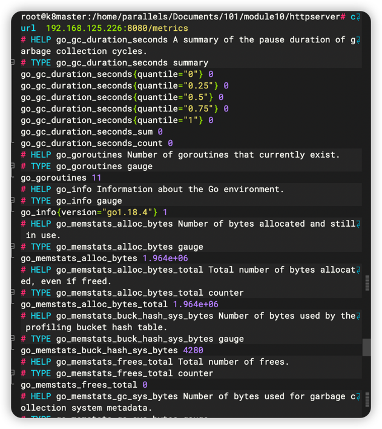
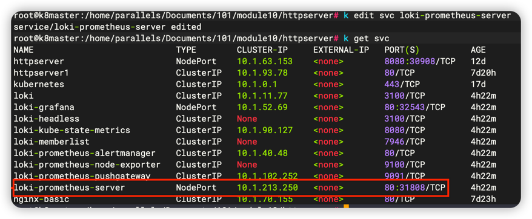

# module10 - http server 部署搭配 Metric 和 Prometheus

> note: 此OS架構為 linux/arm64

## 實作部分

> 採用之前的http server進行修改

1. 提供兩個接口：`/hello`、`/metrics`
   - /hello：從此接口加入時間0-2秒隨機延遲指標
2. 部署至測試集群，並完成`Prometheus`配置
3. 從`Prometheus`、`Grafana` dashboard查看延遲分配情況


- httpserver yaml
```go
apiVersion: apps/v1
kind: Deployment
metadata:
  name: httpserver
spec:
  replicas: 1
  selector:
    matchLabels:
      app: httpserver
  template:
    metadata:
      annotations:
        prometheus.io/scrape: "true"
        prometheus.io/port: httpserver
      labels:
        app: httpserver
    spec:
      containers:
        - name: httpserver
          imagePullPolicy: Always
          image: jwang10/cncamp-http-server:v1.0-metrics
          ports:
            - containerPort: 8080
```

## 注意事項

- httpserver yaml中的`containerPort`要跟實際`server`端口一致，否則`prometheus`無法連接到

## Demo




- metrics info



- prometheus dashboard 
  
  - 因為剛剛有把`pod`刪除重建，所以下方`port`端口從`226`變成`227` 


- grafana dashboard

  - 因為是採用`int` 0-2秒隨機數等待，故區間相較於`ms`來得大

