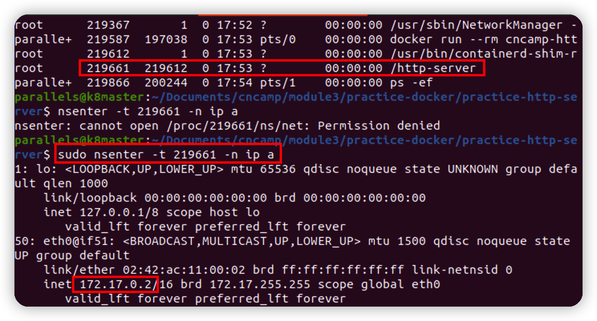

# module3 - docker-http-server

> note: 此OS架構為 linux/arm64

* [使用方式](#使用方式)
* [手動操作](#手動操作)
* [注意事項](#注意事項)

### 使用方式
- 從docker hub拉包, 或是透過[手動操作](#手動操作)
```shell
docker pull jwang10/cncamp-http-server:latest
```
- 透過下方指令執行即可
```shell
docker run -dp 8080:8080 jwang10/cncamp-http-server
```


### 手動操作

此部分分三部分
1. 建立Dockerfile
2. push dockerfile to docker hub
3. 查看 container ip

> note： 此部分還需注意`容器網路`問題
> 它們是透過使用 Linux 的 libnetwork 所建立出來的網路模式，網路模式分為下面幾種
>
> - none： 在執行 container 時，網路功能是關閉的，所以無法與此 container 連線
> - container： 使用相同的 Network Namespace，所以 container1 的 IP 是 172.17.0.2 那 container2 的 IP 也會是 172.17.0.2
> - host： container 的網路設定和實體主機使用相同的網路設定，所以 container 裡面也就可以修改實體機器的網路設定，因此使用此模式需要考慮網路安全性上的問題
> - bridge： Docker 預設就是使用此網路模式，這種網路模式就像是 NAT 的網路模式，例如實體主機的 IP 是 192.168.1.10 它會對應到 Container 裡面的 172.17.0.2，在啟動 Docker 的 service 時會有一個 docker0 的網路卡就是在做此網路的橋接
> - overlay： container 之間可以在不同的實體機器上做連線，例如 Host1 有一個 container1，然後 Host2 有一個 container2，container1 就可以使用 overlay 的網路模式和 container2 做網路的連線

- A normal Dockerfile
```dockerfile
# syntax=jwang/http-server:1
FROM golang:1.18-alpine

WORKDIR /practice-http-server

COPY . .
RUN echo "Install dependent modules" && \
    go mod download && go mod verify

RUN echo "Copy files" && \
   cd demo/ && \
   go build -o /http-server

EXPOSE 8080

CMD ["/http-server"]

```
- Resize Dockerfile
```dockerfile
FROM golang:1.18-alpine AS builder

ENV CGO_ENABLED=0 
#   GO111MODULE=off  \
#	GOOS=linux    \
#	GOARCH=amd64

WORKDIR /build
COPY . .
RUN echo "Install dependent modules" && \
    go mod download && go mod verify && \
    cd demo/ && \
    go build -o http-server .

FROM busybox
COPY --from=builder /build/demo/http-server /
EXPOSE 8080
CMD ["/http-server"]
#ENTRYPOINT ["/http-server"]
```

- 查看local ip
  
- 使用下面指令查看容器內部ip
```shell
ps -ef | grep <launch-file>
sudo nsenter -t <PID> -n ip a
```


### 注意事項

- 此在縮小鏡像體積時候，遇到以下錯誤
  - solved： 在`dockerfile`中加入`cgo=0`的環境變數
  