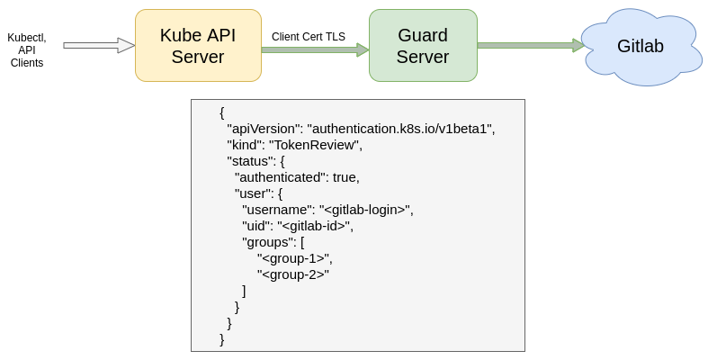

# Auth-Webhook

採用`Gitlab api` + `k8s-v1 api`建立k8s webhook授權後台

流程參考如下圖 by AppsCode


## demo

```go
$ curl http://localhost:3000/authenticate
{"apiVersion":"authentication.k8s.io/v1beta1","kind":"TokenReview","status":{"authenticated":true,"user":{"username":"JWang10","uid":<uuid>}}}

```

## ref

- https://appscode.com/products/guard/v0.7.1/guides/authenticator/gitlab/