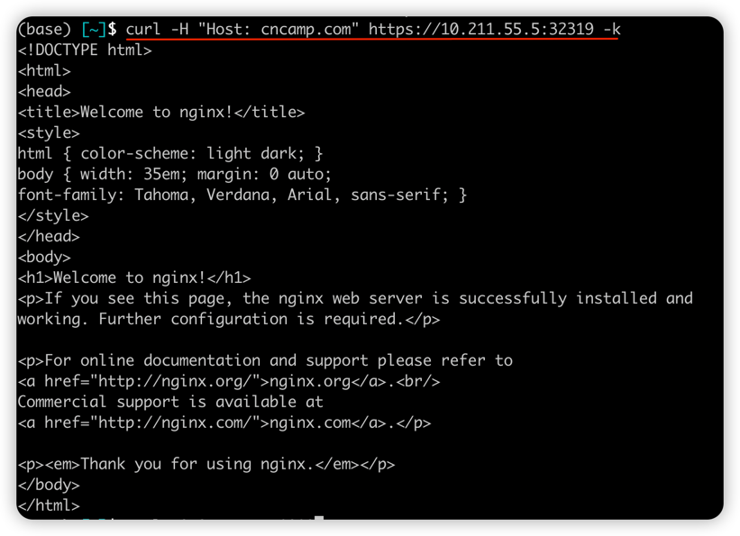

# module8 - http server 部署至 k8s

> note: 此OS架構為 linux/arm64

此項目採用之前module3建立的`httpserver image`
把環境參數或是設定透過`ConfigMap`進行控制。

### Usage

把`pod`和相對應的`configmap`加入集群即可訪問。

```shell
kubectl create -f httpserver.yaml
kubectl create -f config.yaml // config map
```

- Update

  補充源碼部分，提供`log`訊息和程式優雅關閉

  加入 `Service` 和 `Ingress`方式暴露對外開放端口

  - **Service**

    可以採用以下指令方式或是加入`svc.yaml`到集群
  
    ```go
    kubectl expose deploy httpserver --selector app=httpserver --port=30908 --type=NodePort
    ```
  
  - **Ingress - nginx**
  
    `Ingress`簡易，只需要設定`tls`、`rules`
  
    - 我們先建立`tls`所採用的證書，後建立`Secret`來保證通訊安全
  
    ```shell
    # build crt and key
    openssl req -x509 -nodes -days 365 -newkey rsa:2048 -keyout tls.key -out tls.crt -subj "/CN=cncamp.com/O=cncamp"
    
    # add a secret with the key and crt
    kubectl create secret tls cncamp-tls --cert=./tls.crt --key=./tls.key
    ```
  
    backend pod 搭配`nginx`部署，或是`httpserver`
  
    `Ingress`統一管理接入口，透過`nginx`轉發給`backend pod` 
    
  
    ```go
    // -k : 代表不驗證peer, 沒加上此參數會出現SSL錯誤
    curl -H "Host: cncamp.com" https://10.1.109.83 -k
    ```
    
  
    
  

### 項目部署實現

- 優雅啟動
- 優雅關閉
- 配置資源需求跟Qos
- 實現 liveness、readiness探活
- 日誌訊息


### Demo


- Update
  
  - 補充之前的優雅關閉和log訊息
  


`Service`透過`node`的對外ip及暴露的port即可取得資訊


`Ingress`也可透過`NodePort`對外提供訪問



